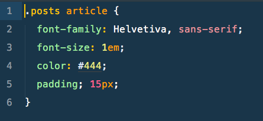

# Hello, World Wide Web!
### Beginners Coding Workshop - Stage #0

## What makes up a website?
Bring on the languages of the Internet!

### HTML - Hypertext Markup Language

Gives content structure and hierarchy.

### CSS - Cascading Style Sheets

Gives the content colors, fonts, and design.

### JS - Javascript
Not covered in this course, Javascript helps with user interactions. When a button is clicked, what should happen?

Checkout a Bootstrap Modal example:
https://codepen.io/DawsonMediaD/pen/byDqv

## How do these languages work together?

## The Browser
With the above ingredients, the browser knows what to do with them.

