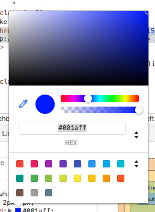

# Beautiful pages with CSS
### Beginners Coding Workshop - Stage #2

## slide deck
[https://docs.google.com/presentation/d/1D0ZityRJ7nnBM3glEjirlrTdINdhYLBbV8Y9eLLr3a0/edit#slide=id.gc6f59039d_0_0](https://docs.google.com/presentation/d/1D0ZityRJ7nnBM3glEjirlrTdINdhYLBbV8Y9eLLr3a0/edit#slide=id.gc6f59039d_0_0)

## important to remember
* CSS is not intuitive. So, give it time and welcome to the party.
* CSS is cascading. Meading the last style overwrites everything before it. CSS goes in order from top to bottom

## selectors
* tag `div` would select all `div`
* class `.cake` would change all elements of `<div class="cake"></div>`
* id `#chocolate` would only select one `<div class="cake" id="chocolate"></div>`

## relational selections
* select `.cake > .layer` would select on the layer in the cake
```

<div class="table">
	<div class="cake">
		<div class="layer">this one</div>
	</div>
	<div class="layer"></div>
</div>

```
* select `.cake + .layer` would select on the layer in the cake
```

<div class="table">
	<div class="cake">
		<div class="layer"></div>
	</div>
	<div class="layer">this one</div>
</div>

```

## CSS game to practice selectors
[CSS Diner](https://flukeout.github.io/)

## Colors
There are a few ways you'll see colors definded:

Literal
* `color: red;`
* `color: blue;`
* `color: green;`

HEX (hexadecimal)
* `color: #f00; /* red */`
* `color: #001aff; /* blue */`
* `color: #2f0; /* green */`

RGBA (red green blue alpha)
* `color: rgb(255, 0, 0); /* red */`
* `color: rgb(0, 26, 255); /* blue */`
* `color: rgb(34, 255, 0); /* green */`

There is a method to the madness, but you'll be happy to know there are color pickers to help you.



## CSS property list
Here are some of the lists of properties you'll see in the wild. You'll want to use these a good bit.

```
p {
	font-size: 18px;
	font-family: sans-serif;
	color: #333;
	line-height: 1em;
}
.service {
	border: 1px solid #333;
	padding: 10px 14px;
	margin: 0;
	width: 100%;
	height: auto;
	background-color: #fff;
}
```

## Get some practice
Head to CodePen.io