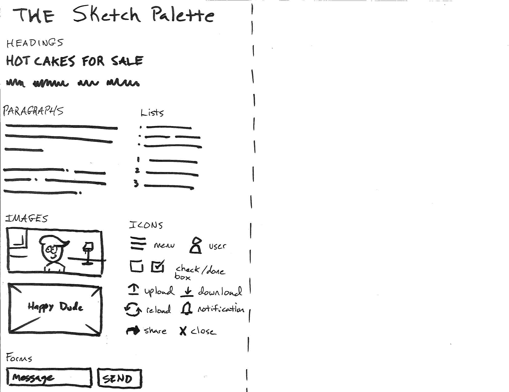

# Sketch your idea
### Beginners Coding Workshop - Stage #3

## Get your ideas on paper
There are lots of digital tools for sketch, but paper is permanent. Your brain responds differently to something you can't erase or undo.

## Explore elements of sketching websites and apps
Here is a rough sketch of elements you can use to sketch your website.

## Let's sketch
- follow the leader
- example site
- real site

## Next up
* ~~stage 0 - [Hello, World Wide Web](stage-0.md)~~
* ~~stage 1 - [Let's learn HTML](stage-1.md)~~
* ~~stage 2 - [Beautiful pages with CSS](stage-2.md)~~
* ~~stage 3 - [Sketch your idea](stage-3.md)~~
* stage 4 - [Bootstrap for speedy design](stage-4.md)
* stage 5 - [Build your site](stage-5.md)